# [GB] Metroid 2 - Return of Samus

Este é um projeto de tradução do jogo Metroid 2 - Return of Samus, de Gameboy, para português do Brasil.

Continuação direta do Metroid de NES (também do Metroid Zero Mission, consequentemente), é o segundo jogo da série Metroid, e também o único lançado para Gameboy. A jogabilidade é bastante parecida com seu predecessor de NES, porém havendo melhorias gráficas e novos itens.

# Informações

Nome do jogo: Metroid 2 - Return of Samus

Versão: Americana

Plataforma: Gameboy

Desenvolvedora: Nintendo

Distribuidora: Nintendo

Gênero: Plataforma / Metroidvania

Jogadores: 1

# Enredo

Pouco tempo se passou desde que Samus destruiu a base dos Piratas Espaciais, situada em Zebes.

Anteriormente em Zebes, Samus havia matado todos os Metroids e frustrado experimentos de procriação destes seres, feitos pelos Piratas Espaciais que lá residiam.

Para evitar que alguém faça mau uso dos Metroids, a Federação Galáctica envia uma nave de pesquisa ao planeta SR388, terra natal dos Metroids, para colher informações para levar tal espécie à extinção. Porém, estranhamente o contato com esta nave foi perdido pouco tempo depois de chegarem lá. Enviaram equipes de resgate e pelotões de combate, um após outro, para investigarem. Mas, nenhum deles voltou vivo.

Ao perceber a ameaça dos Metroids, a Federação Galáctica envia Samus a SR388, com uma missão: levar os Metroids à extinção. Deverá aprofundar-se nas suas escuras cavernas, caçando e matando-os um por um.

Chegando lá, ela percebe que os Metroids em SR388 são muito mais fortes que os de antes. Os Metroids que ela matou em Zebes eram apenas larvas, enquanto que em SR388 a maioria deles estão em formas mais evoluídas. Lá, ela depara-se com vários tipos de Metroid: Alfa, Gama, Zeta, dentre outros.

Será ela capaz de cumprir tal missão?

# Sobre a tradução

Essa é uma tradução que iniciei desse jogo entre 2008 e 2009, enquanto membro do finado grupo da Trans-Center. Após ter feito a tradução do Metroid Zero Mission, o primeiro jogo da linha do tempo principal, vi que ainda não havia uma tradução para sua continuação de Gameboy lançada em 1991. Isso me motivou a seguir com o projeto, com o apoio do Darkl0rd. Foi durante meus primeiros anos de romhacking, e foi um projeto fácil e rápido, com pouquíssimos textos e gráficos para serem editados, zero compressão envolvida e sem necessidade de sequer manipular ponteiros.

Em poucas semanas a versão 1.0 foi lançada, na época disponibilizada apenas em conjunto com o patch de coloração do Zorlon, que foi uma tentativa de converter o jogo para Gameboy Color adicionando mais cores, porém que era um tanto bugado. Alguns meses depois, a pedido de outros jogadores, foi lançada a versão 1.1, contendo correções menores e a disponibilização da tradução em dois patches: um sendo o jogo vanilla e outro a tradução combinada com o patch de coloração.

Dezoito anos depois, após o lançamento do Metroid Prime 4 no final de 2025, criamos a "Iniciativa Metroid" com o objetivo de revisitar todas as fã-traduções de Metroid para adequá-las à terminologia de localização PT-BR oficial da Nintendo, tendo esse [glossário](https://github.com/leomontenegro6/metroid-zero-mission-traducao-ptbr/blob/master/Anotacoes/Gloss%C3%A1rio.md) por base, contendo termos como:

- Morph Ball: Morfosfera
- Spider Ball: Aracnosfera
- Spring Ball: Saltosfera
- Varia Suit: Traje Varia
- Metroid: Metroid (mantido original)

Esse é o segundo título dessa iniciativa a ter sua tradução revisada. No processo, optei praticamente por recriar a tradução inteira com armips, onde utilizei essa ferramenta como facilitador para inserção de assets traduzidos como textos e gráficos. No processo, os gráficos foram extraídos para arquivos avulsos, para serem editados no Tile Molester de forma externa à ROM, para em seguida serem inseridos via instruções `incbin`. O mesmo valeu para os poucos textos ingame, onde foram criados vários arquivos .tbl menores para mapear os valores dos textos e tiles, para posteriormente serem inseridos via `.stringn`. 

A tradução também foi recriada visando tornará-la compatível com alguns hacks como "EJRTQ Colorization" e "LOO-E Map Hack". O primeiro é tido como o melhor hack de colorização existente, lançado em 2019, sendo mais estável e melhor colorido que o antigo do Zorlon. O segundo é um hack que adiciona uma tela de mapa ao apertar start, lançado em 2015, melhorando consideravelmente a jogabilidade do jogo original. É possível jogar a tradução tanto avulsamente como combinado com esses hacks, feito este que foi possível graças ao apoio de colegas do servidor do discord do [Metroid Construction](https://metroidconstruction.com/). No entanto, até então, ainda não dá pra combinar os hacks de colorização com o dos mapas, pois devido à forma como foram construídos, atualmente são incompatíveis um com o outro. Futuramente, está previsto uma forma de juntar ambos num hack de Metroid 2 DX, mas enquanto isso não ocorre, tenham em mente de usar só um ou outro.

A versão 1.2 da tradução conta com as seguintes novidades:

- Inclusão da terminologia oficial introduzida no Metroid Prime 4
- Tornada a tradução compatível com alguns hacks de aprimoramento, como:
  - [EJRTQ Colorization 1.3](https://metroidconstruction.com/hack.php?id=400): Hack que converte o jogo de gameboy monocromático em gameboy color, adicionando cores únicas para inimigos e cenários diversos.
  - [LOO-E Map Hack 1.2](https://metroidconstruction.com/hack.php?id=844): Hack que adiciona um mapa detalhado que registra a posição do jogador, itens coletados, níveis de ácido e metroids mortos. Também adiciona uma tela de inventário que permite ativar/desativar habilidades da Samus.

Nos nossos testes, os hacks de aprimoramento acima funcionaram muito bem com a tradução. No entanto, para outros hacks além dos listados acima, será preciso fazer trabalhos adicionais de adaptação, o que pode ser relativamente trabalhoso. Caso alguém se interesse em tentar tornar a tradução compatível com algum outro hack, veja a seção de perguntas e respostas.

Com isso, lançamos a versão 1.2 da tradução, após quase 18 anos depois. Espero que usufruam desse trabalho, da mesma forma que também o fizemos nesse processo.

# Equipe

- **Solid One**: Romhacking geral, gráficos, tradução e teste;
- **Darkl0rd**: Revisão e teste ingame da versão 1.0 lá de 2008;
- **Ted**: Criação de capas traduzidas;

# Status da Tradução

Textos: 100%

Acentos: 100%

Gráficos: 100%

Revisão: 100%

# Perguntas e Respostas

**P1**: Como eu faço para combinar a tradução com os patches de aprimoramento, como EJRTQ Colorization e LOO-E Map Hack por exemplo?

**R1**: Junto ao arquivo zipado contendo o patch de tradução da versão vanilla, também estão patches opcionais contendo a tradução e cada patch de aprimoramento combinados. Optei por distribuir assim para facilitar o uso para usuários finais, e esses patches foram inclusos mediante permissão dos autores originais.

**P2**: É possível combinar simultaneamente o EJRTQ Colorization e LOO-E Map Hack?

**R2**: Infelizmente, devido à forma como cada hack foi construído, eles atualmente são incompatíveis entre si. No entanto, está sendo criado um hack novo chamado [Metroid 2 Redux](https://github.com/ShadowOne333/Metroid2-Redux), com a ideia de criar uma versão definitiva do jogo, contemplando coloração, hack de mapas e diversos outros aprimoramentos. Enquanto isso, o melhor que dá pra fazer é jogar a versão de gameboy em modo GBC, que define os backgrounds em azul e os sprites em amarelo com vermelho, assim contendo algumas cores a mais.

**P3**: A tradução é compatível com outros hacks de aprimoramento, além dos mencionados?

**R3**: Até o momento, apenas o EJRTQ Colorization e o LOO-E Map Hack foram tornados compatíveis com a tradução. Para cada um deles, foi necessário fazer certo um volume de trabalho que foi além de apenas mergear assets, chegando a precisar retraduzir diversos assets do jogo. Dependendo de cada caso, pode ser que o mesmo talvez precise ser feito para outros hacks, o que seria mais trabalhoso. No entanto, caso queira tornar algum outro hack compatível com a tradução, sinta-se livre de forkar o repositório e experimentar.

# Imagens

Versão Original:

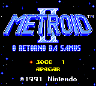 

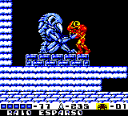 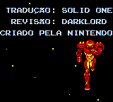

EJRTQ Colorization:

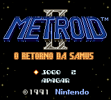 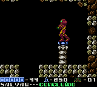

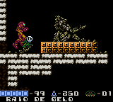 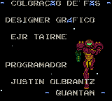

LOO-E Map Hack:

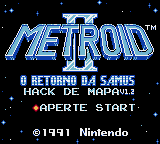 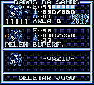

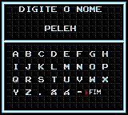 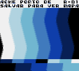

 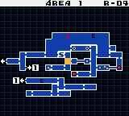

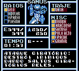 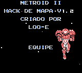

# Patch

O patch de tradução está disponível na seção de releases desse repositório. Está em formato IPS, e vocês podem aplicá-lo através de programas como [Floating IPS](https://www.romhacking.net/utilities/1040/) ou similares.

Esta tradução pode ser aplicada na ROM "Metroid II - Return of Samus (W) [!].gb", com header, de crc DEE05370 / md5sum 9639948AD274FA15281F549E5F9C4D87.